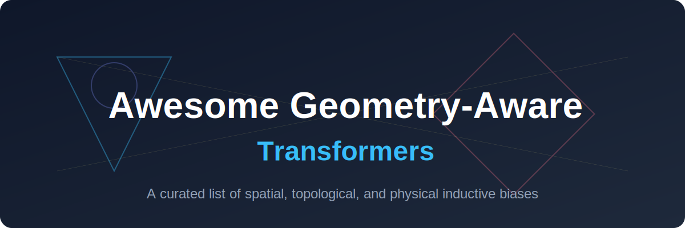

  
  
  # Awesome Geometry-Aware Transformers 📐

  
  
  
  
  

  **A curated list of geometry-aware transformer variants, implementing spatial, topological, and physical inductive biases for 3D data, molecules, and physics simulations.**

  [Introduction](#introduction) • [Variants](#geometry-aware-transformer-variants) • [Research](#research) • [Contributing](#contributing)

 

## 🚀 Introduction

Geometry-Aware Transformers inject explicit spatial, topological, or physical inductive biases into standard attention mechanisms. While vanilla Transformers treat inputs as flat sequences, geometry-aware variants model the coordinate matrices, distance matrices, aspect ratios, or algebraic structures of physical systems (such as 3D molecules, point clouds, and mesh surfaces).

## 🧩 Geometry-Aware Transformer Variants

### 1. 3D & Point Cloud Transformers ☁️
* **Definition:** Architectures designed to directly consume unstructured, non-Euclidean 3D coordinate data.
* **Mechanism:** They replace or enhance standard self-attention by incorporating Euclidean distance, relative position vectors, or dynamic graphs between coordinates (e.g., K-Nearest Neighbors).
* **First Used:** December 2020
* **Primary Paper:** [Point Transformer](https://arxiv.org/abs/2012.09164)
* **Notable Implementations:** **Point Transformer**, **DGCNN (Dynamic Graph CNN)** extensions, and specialized Geometrically-Aware Transformers for point cloud processing.
* **Core Benefit:** Bypasses voxelization or multi-view projection, learning directly from raw point distributions with strict geometric fidelity.
* **Detailed Info:** [3D & Point Cloud Transformers](docs/point_cloud_transformers.md)

### 2. Equivariant & Geometric Algebra Transformers ⚖️
* **Definition:** Advanced networks that enforce physical symmetries (such as $E(3)$ or $SE(3)$ invariance/equivariance) directly into hidden states.
* **Mechanism:** They utilize Geometric (Clifford) Algebra to represent coordinates, vectors, and planes natively. Layers execute equivariant matrix transformations where translating or rotating the input guarantees an identical translation/rotation of the features.
* **First Used:** May 2023
* **Primary Paper:** [GATr: Geometric Algebra Transformer](https://arxiv.org/abs/2305.18415)
* **Notable Implementations:** **GATr (Geometric Algebra Transformer)** and **EGNN-based Transformers**.
* **Core Benefit:** Highly data-efficient; models learn structural dynamics (e.g., N-body physics simulations, protein folding) using only a fraction of the traditional training data.
* **Detailed Info:** [Equivariant & Geometric Algebra Transformers](docs/equivariant_transformers.md)

### 3. PDE & Continuum Operator Transformers 🌊
* **Definition:** Mesh-free architectures designed to solve partial differential equations (PDEs) across highly irregular, arbitrary shapes.
* **Mechanism:** They combine Graph Neural Operator (GNO) localized feature integration with global Vision Transformer processors. They utilize geometric embeddings to preserve statistical shapes of complex boundaries.
* **First Used:** May 2025
* **Primary Paper:** [GAOT: Geometry Aware Operator Transformer](https://arxiv.org/abs/2505.18781)
* **Notable Implementations:** **GAOT (Geometry Aware Operator Transformer)** and **Transolver**.
* **Core Benefit:** Tremendous computational scalability for multi-scale industrial Computational Fluid Dynamics (CFD) and aerodynamic simulations.
* **Detailed Info:** [PDE & Continuum Operator Transformers](docs/pde_operator_transformers.md)

### 4. Graph & Molecular Transformers 🧬
* **Definition:** Deep learning architectures engineered to model molecular geometries and crystal structures.
* **Mechanism:** The self-attention matrix is explicitly biased by structural bond lengths, dihedral angles, and 3D atomic coordinates.
* **First Used:** June 2021
* **Primary Paper:** [Graphormer](https://arxiv.org/abs/2106.05234)
* **Notable Implementations:** **Graphormer**, **Graphormer-3D**, and geometry-biased attention mechanics.
* **Core Benefit:** Significantly improves accuracy in molecular property prediction, drug discovery, and quantum chemistry modeling.
* **Detailed Info:** [Graph & Molecular Transformers](docs/graph_molecular_transformers.md)

### 5. 3D Mesh & Vision-Language Transformers 🕸️
* **Definition:** Transformers modified to process complex computer graphics meshes or multi-resolution scene views.
* **Mechanism:** They exploit face convolutions, mesh-simplification pooling, or specialized attention like **GTA (Geometry-Aware Attention)** to map multi-view 2D images back into a shared 3D geometric reality.
* **First Used:** October 2023
* **Primary Paper:** [GTA: Geometry-Aware Attention Transformer](https://arxiv.org/abs/2310.10375)
* **Notable Implementations:** **GTA-Transformer** and **Circle-RoPE** for aspect-ratio invariant vision systems.
* **Core Benefit:** Ensures robustness against re-meshing, viewpoint distortions, and variable camera trajectories.
* **Detailed Info:** [3D Mesh & Vision-Language Transformers](docs/mesh_vision_transformers.md)

## 📈 Star History

   <a href="https://www.star-history.com/#ishandutta2007/Awesome-Geometry-Aware-Transformers&Date">
    <picture>
      <source media="(prefers-color-scheme: dark)" srcset="https://api.star-history.com/svg?repos=ishandutta2007/Awesome-Geometry-Aware-Transformers&type=Date&theme=dark" />
      <source media="(prefers-color-scheme: light)" srcset="https://api.star-history.com/svg?repos=ishandutta2007/Awesome-Geometry-Aware-Transformers&type=Date" />
      
    </picture>
   </a>

## 🛠️ Contributing

Contributions are welcome! If you have a suggestion or found a paper that should be here, please open an issue or submit a pull request.

## 📄 License

This project is licensed under the MIT License - see the [LICENSE](LICENSE) file for details.
