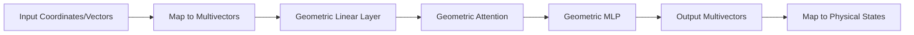

# Equivariant & Geometric Algebra Transformers

These models enforce physical symmetries directly in the architecture. Equivariance means that if the input is rotated or translated, the output features are rotated or translated in the same way.

## Architecture & Mechanism

Geometric Algebra Transformers (GATr) use **Clifford Algebra** to represent geometric primitives.
1. **Multivectors:** Representing points, lines, and planes as a single algebraic object.
2. **Geometric Product:** Using algebraic operations that are inherently equivariant.
3. **Equivariant Layers:** Standard transformer layers (linear, attention, MLP) are replaced with their geometric algebra counterparts.

## Diagram

## First Used
- **Date:** May 2023
- **Paper:** [GATr: Geometric Algebra Transformer](https://arxiv.org/abs/2305.18415)

[Back to Home](../README.md)
