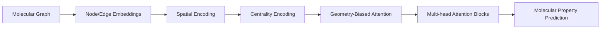

# Graph & Molecular Transformers

Graphormers extend transformers to graph-structured data, specifically for molecular modeling where 3D geometry is crucial.

## Architecture & Mechanism

1. **Centrality Encoding:** Adds degree information to nodes.
2. **Spatial Encoding:** Injects the shortest path distance between nodes into the attention matrix.
3. **Edge Encoding:** Incorporates bond types and lengths.
4. **3D Bias:** Direct injection of Euclidean distances between atoms.

## Diagram

## First Used
- **Date:** June 2021
- **Paper:** [Graphormer](https://arxiv.org/abs/2106.05234)

[Back to Home](../README.md)
