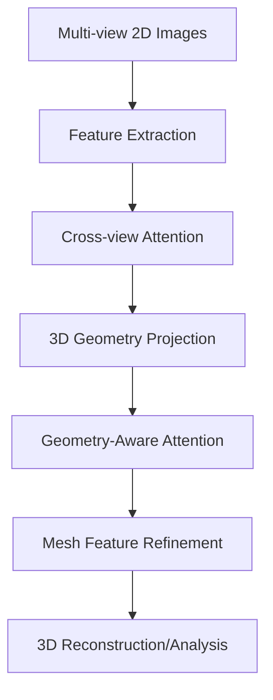

# 3D Mesh & Vision-Language Transformers

These models bridge the gap between 2D images and 3D geometric meshes, often used in computer graphics and vision.

## Architecture & Mechanism

1. **Cross-View Attention:** Relating features across different camera views.
2. **Geometry-Aware Attention (GTA):** Bias attention based on the underlying 3D structure (faces, edges).
3. **Mesh Simplification Pooling:** Handling different resolutions of the mesh.

## Diagram

## First Used
- **Date:** October 2023
- **Paper:** [GTA: Geometry-Aware Attention Transformer](https://arxiv.org/abs/2310.10375)

[Back to Home](../README.md)
