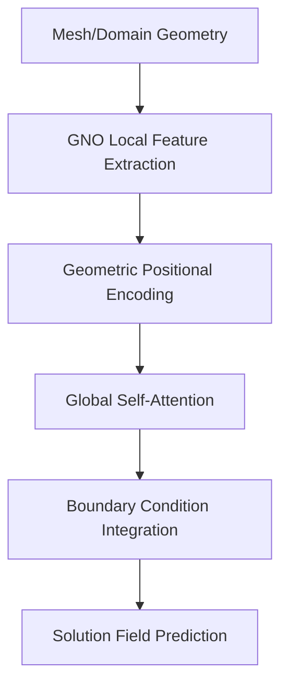

# PDE & Continuum Operator Transformers

Designed for solving Partial Differential Equations (PDEs) on irregular domains, these models treat the transformer as an operator between function spaces.

## Architecture & Mechanism

Geometry Aware Operator Transformers (GAOT) combine local and global information:
1. **Graph Neural Operator (GNO):** Handles local message passing on the mesh.
2. **Global Transformer:** Captures long-range dependencies across the entire domain.
3. **Geometric Embeddings:** Preserves the shape and boundaries of the domain.

## Diagram

## First Used
- **Date:** May 2025
- **Paper:** [GAOT: Geometry Aware Operator Transformer](https://arxiv.org/abs/2505.18781)

[Back to Home](../README.md)
