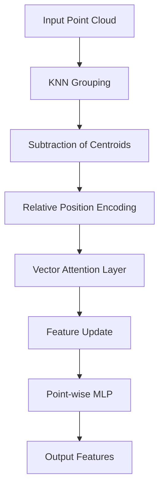

# 3D & Point Cloud Transformers

3D & Point Cloud Transformers are designed to process unstructured 3D data. Unlike traditional transformers that work on sequences, these models handle sets of points $(x, y, z)$ and their associated features.

## Architecture & Mechanism

The key challenge is the lack of a natural order in point clouds. Point Transformers solve this by using:
1. **Local Grouping:** Using K-Nearest Neighbors (KNN) to find local neighborhoods.
2. **Vector Attention:** Instead of scalar attention, they use vector attention to better capture 3D relationships.
3. **Relative Position Encoding:** Encoding the distance and direction between points.

## Diagram

## First Used
- **Date:** December 2020
- **Paper:** [Point Transformer](https://arxiv.org/abs/2012.09164)

[Back to Home](../README.md)
